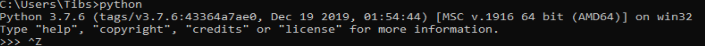
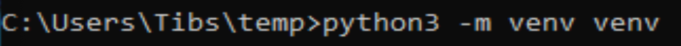
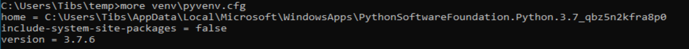
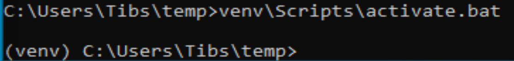
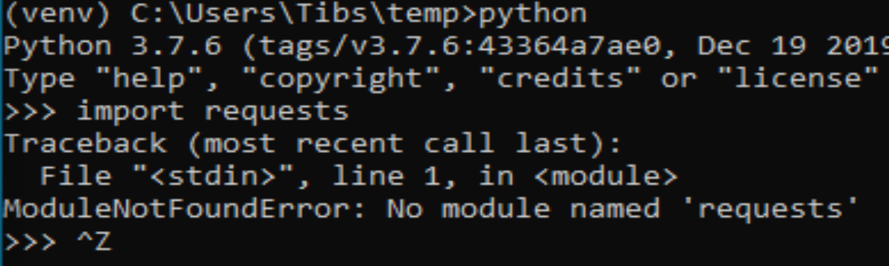
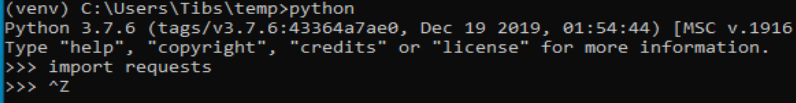
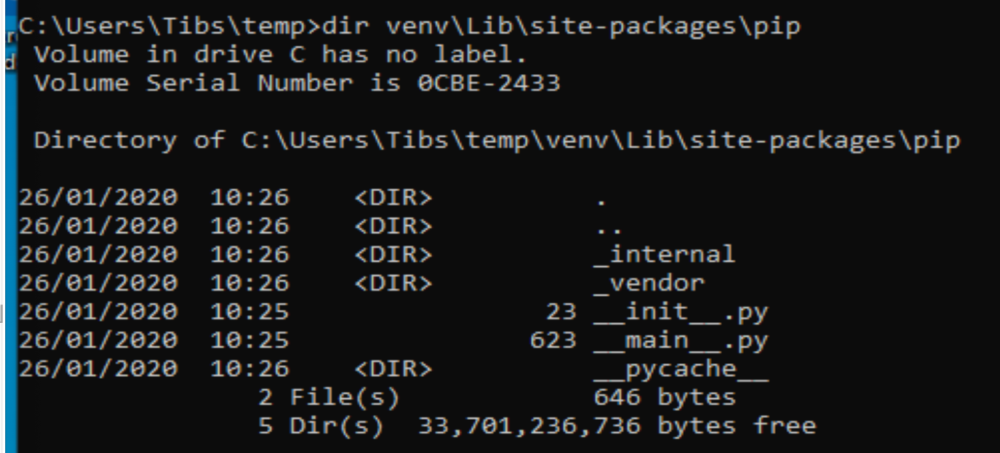
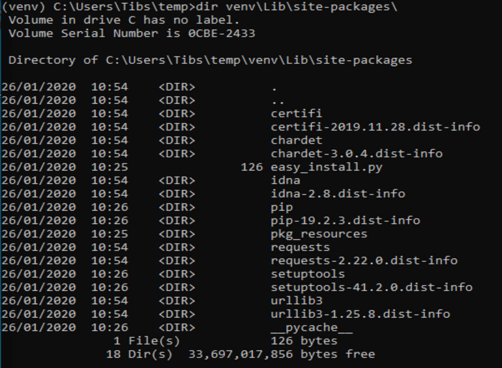

==============================================
An introduction to Python virtual environments
==============================================

https://www.pluralsight.com/tech-blog/managing-python-environments/ looks like
a really good resource.

https://interrupt.memfault.com/blog/conda-developer-environments - using conda

From ntoll:
Gu
   ...PROBLEMS setting up Virtualenv to be used with VSCode on
   Windows. It turns out that if you Google "VSCode Windows Virtualenv"
   this is the top result:
   https://code.visualstudio.com/docs/python/environments which looks
   exactly like what she needs to read.

https://www.b-list.org/weblog/2020/jan/05/packaging/ - A Python Packaging
Carol "Quite often, I see people being wrong on the internet about Python
packaging. But the way in which they’re wrong is subtle, and often passes
unnoticed. The issue with much of the discussion is in conflating multiple
different things under the term “packaging”, and failing to be clear exactly
which of them is being discussed or criticized. In the spirit of Dickens, I’d
like to break up the concept of “packaging” into at least three different
topics, each associated with a specific use case, and then talk a bit about
each of them"

Links
=====

Official documentation:

* `Creating Virtual Environments`_ in the `Python Packaging User Guide`_
* `venv - Creation of virtual environments`_ in the Python library documentation
* `Virtual Environments and Packages`_ in the Python tutorial

.. _`Creating Virtual Environments`:
    https://packaging.python.org/tutorials/installing-packages/#creating-virtual-environments
.. _`Python Packaging User Guide`:
    https://packaging.python.org/tutorials/installing-packages
.. _`venv - Creation of virtual environments`: https://docs.python.org/3/library/venv.html
.. _`Virtual Environments and Packages`: https://docs.python.org/3/tutorial/venv.html

Other interesting pages:

* `An Effective Python Environment: Making Yourself at Home`_, at `Real Python`_
* `A Guide to Python Virtual Environments with virtualenvwrapper`_
* `How to create a Python 3 virtual environment in Windows 10`_
* `Virtual Environments`_ at `The Hitchhiker's Guide to Python`_, which shows
  how to use `virtualenv`_ and `virtualenvwrapper`_
  
.. _`An Effective Python Environment: Making Yourself at Home`:
   https://realpython.com/effective-python-environment/
.. _`Real Python`: https://realpython.com
.. _`A Guide to Python Virtual Environments with virtualenvwrapper`:
   https://howchoo.com/g/nwewzjmzmjc/a-guide-to-python-virtual-environments-with-virtualenvwrapper
.. _`How to create a Python 3 virtual environment in Windows 10`:
   https://www.techcoil.com/blog/how-to-create-a-python-3-virtual-environment-in-windows-10/
.. _`Virtual Environments`: https://python-guide-ru.readthedocs.io/en/latest/dev/virtualenvs.html
.. _`The Hitchhiker's Guide to Python`: https://python-guide-ru.readthedocs.io/

I don't talk about using ``conda`` here, but it's an alternative to the normal
Python virtual environment mechanisms that was introduced by the Anaconda_
project, which is much used in scientific Python.

* `Getting started with Python environments (using Conda)`_

.. _Anaconda: https://anaconda.org/
.. _`Getting started with Python environments (using Conda)`:
   https://towardsdatascience.com/getting-started-with-python-environments-using-conda-32e9f2779307
   
.. _virtualenv:
.. _virtualenvwrapper:

-----------------------------------

Other topics:

* pycharm
* vscode
* jupyter notebook
* conda (see above)
* pyenv
* pideptree https://pypi.org/project/pipdeptree/ https://github.com/naiquevin/pipdeptree
* virtualenvwrapper (and why I no longer use it). Note to warn that it was
  built for Python 2 originally, and ``mkvirtualenv`` may not work quite the
  same way as ``python3 -m venv``.
* direnv https://direnv.net/ (and perhaps also https://github.com/purajit/venv_manager)
* pipenv
* poetry
* other approachs:

  * https://github.com/replit/upm
  * what else?

-----------------------------------

Why one needs to do this

How one does this

What it does / how it works

How to use it

* "project" - one venv per directory tree
* ??? - one venv per purpose

Related: IDEs
  
Related: multiple Pythons

Related: wrapper tools

-----------------------------------

Why do we need virtual environments
===================================

Shouldn't alter the system Python
---------------------------------

Sometimes the Python provided by your operating system is actually acceptable.
This can, for instance happen with Linux systems, where you might be quite
happy with the version of Python installed by the system package mechanisms.

And if you're happy only using software that can be installed by this route
(e.g., by ``apt-get`` or ``yum`` or whatever), then you *could* argue that you
don't need virtual environments.

However, in practice you are eventually likely to want to install something
more recent that your operating system provides, or perhaps a package that the
operating system tools don't make available.

The thing to remember here is:

  Don't mix installing things by the operating system mechanisms and the
  language-specific mechanisms.

In other words, if you have an OS installed Python, don't try to update it
using ``pip``.

Luckily, most systems make this hard (on Linux you'd typically need to use
``sudo``), which is a good hint not to do it!

Why not, though?

There are three reasons:

Firstly, it's quite possible that the OS itself is using that version of
Python, and if you change what is installed, you may break the things the OS
relies on. This is hard to detect beforehand.

Secondly, OS packaging solutions keep a record of what they have installed, so
they can correctly update or remove packages. If you "go behind their back",
their recorded knowledge will be wrong, which can lead to problems when trying
to upgrade.

Thirdly, it still doesn't help with the "need for different versions for
different purposes" problem, that we will get to later on.

Can't alter the available Python
--------------------------------

Sometimes the person managing your computer doesn't let you alter the
available Python libraries. This may be for company legal reasons, or
whatever.

    Note that ``pip`` *does* actually let you install packages into a
    user-local directory, but that relies on your remembering to do it,
    and there's no obvious visibility that this has been done. And it still
    doesn't addresss the "need for different versions" problem.

Even if you could subvert that, you probably shouldn't.

You want to work on two programs that have conflicting dependencies
-------------------------------------------------------------------

This is the crux of it.

If you are working on existing packages, installed via ``pip``, then they will
automatically install their dependencies. But sometimes two packages depend on
mutually incompatible things - typically, different versions of a package or
set of packages.

So if project A needs versions 1 through 3 of a package, but won't work with 4
or higher, and project B needs at least version 5, then there is a problem
running them both at the same time.

Virtual environments are designed to make it easy to handle this, and also
relatively obvious that you are doing so.

But also, tidiness
------------------

Let us not also forget that we might want to keep things tidy.

If I'm working on project A, I might have a set of dependencies to do with,
perhaps, documentation tools, whereas for project B I need things for machine
learning, and for project C web development. Each of those can imply a large
number of Python packages (particularly the machine learning case), which
don't overlap much. There's no particular reason to have the unnecessary
packages available, and if we constrain our workspace a bit, it makes it
easier to reason about problems when they do occur.

Keeping track
-------------
Need a better name for this one.

A virtual environment lets you be explicit about what you have installed, and
that makes it easier to produce a proper package when you're developing.

``pip freeze`` and ``pipdeptree``

An example
----------

At our January meeting, we were told about ``pypercard``, which is a very nice
package, but has quite a few dependencies. If I want to play with it, then I
probably don't want to "splash" those dependencies all over my normal working
environment, especially if I'm also doing actual work with Python.

How one does this
=================

Note on examples: I shall give examples for "unix" and for Windows. For the
first, "unix" should include most common Linux distributions, and also the
BSDs and Mac OS. I assume your shell is something like bash or zsh or even
fish. For Windows, I assume Windows 10, and I assume your shell is CMD.EXE or
Powershell - I believe either should be OK. My experience is more limited for
Windows, but I shall include actual screenshots.

For the moment, just

What it does / how it works
===========================

Examples
--------

The unix examples are from my Mac at home. They text is cut-and-pasted from
my terminal.

When you see ``tibs ~$`` (or something similar) at the start of a line, that
is my prompt - everything up to the ``$``. So if you're following along, only
type the stuff after the ``$`` (and the space that follows it).

For Windows, I've run Windows 10 in a virtual machine, and made screenshots.
Apologies for those - this seemed the simplest way to do it. I'll mostly only
talk about Windows when I'm talking about its differences from unix.

Make a working directory
------------------------

First, I make a directory to work in, and move there:

.. code:: bash

  tibs ~$ mkdir temp
  tibs ~$ cd temp
  tibs ~/temp$

Check what Python(s) we have available
--------------------------------------

Let's find out what version of Python I'm running - on my machine:

.. code:: bash

  tibs ~/temp$ python --version
  Python 2.7.17
  tibs ~/temp$ python3 --version
  Python 3.7.6

I can investigate that a bit further:

.. code:: bash

  tibs ~/temp$ which python
  /usr/local/bin/python
  tibs ~/temp$ which python3
  /usr/local/bin/python3

As it happens, I installed the Python 3 myself, deliberately, and the Python 2
has been installed as a depencency of something else (otherwise I wouldn't
have bothered).

  My Mac does provide its own version of Python 2, but if I run it I get a
  warning:

  .. code:: bash

    tibs ~/temp$ /usr/bin/python

    WARNING: Python 2.7 is not recommended.
    This version is included in macOS for compatibility with legacy software.
    Future versions of macOS will not include Python 2.7.
    Instead, it is recommended that you transition to using 'python3' from within Terminal.

    Python 2.7.16 (default, Nov  9 2019, 05:55:08)
    [GCC 4.2.1 Compatible Apple LLVM 11.0.0 (clang-1100.0.32.4) (-macos10.15-objc-s on darwin
    Type "help", "copyright", "credits" or "license" for more information.
    >>> ^D

Create a virtual environment
----------------------------

To create a new virtual environment with Python 3, I just need to do:

.. code:: bash

  tibs ~/temp$ python3 -m venv venv

and now if I look, I've got a new directory called ``venv``.

.. code:: bash

  tibs ~/temp$ ls
  venv

Before going any further, let's unpack that command line a bit.

* ``python3`` is the Python I want to use to create the new virtual
  environment. If I wanted to be specific about exactly which Python I wanted,
  and assuming I've got them both installed, I could do:

  .. code:: bash

    $ python3.6 -m venv venv36

  or:

  .. code:: bash

    $ python3.7.1 -m venv venv371

* ``-m venv`` tells Python to load the ``venv`` module and run it.

  The Python standard library comes with several modules that you can run in
  this way. They all end with code like:

  .. code:: python

    if __name__ == '__main__':
        do_something()

  In the case of ``venv.py``, that "do something" is to create the setup for a
  virtual environment for this particular Python.

* ``venv`` is the name of the directory to create which will hold the
  "workings" of the virtual environment. I'll talk about how to choose a name
  for this directory, and where to put it, later on, but for now the name
  ``venv`` is fairly self-explanatory, and the default place, the current
  directory, is what we want.

Activate the virtual environment
--------------------------------

Now, *creating* that directory hasn't done anything else. In particular, it
hasn't activated the virtual environment.

  I am embarrased to acknowledge how many times I've forgotten that!

The next thing we need to do differs slightly depending on what shell we are
using. For bash and zsh, it's simply:

.. code:: bash

   tibs ~/temp$ source venv/bin/activate

If you're old fashioned and use csh, then you should do:

.. code:: bash

   tibs ~/temp$ source venv/bin/activate.csh

and if you use fish (as I do) then you do

.. code:: bash

   tibs ~/temp$ source venv/bin/activate.fish
   
Note that it **will not work** to do:

.. code:: bash

   tibs ~/temp$ venv/bin/activate

even though that *sounds* more sensible.

  I always write the activation command using ``source``, even though most
  shells also allow abbreviating that to ``.`` (dot / period). Since it's hard
  enough to remember that it needs to be sourced, I prefer the longer/more
  obvious form.

On Windows, if you're using CMD.EXE, you do::

  > venv\Scripts\activate.bat

and if you're using Powershell you do::

  PS > venv\Scripts\Activate.ps1

..

  Yes, windows works differently, so there's no equivalent to
  ``source``. Which is nice.

In all cases, the next prompt should now start with ``(venv)`` - that is, the
name of the virtual environment directory, in parentheses.

For instance, in my case::

.. code:: bash

  tibs ~/temp$ source venv/bin/activate.fish
  (venv) tibs ~/temp$

Working in a virtual environment
--------------------------------

So our prompt now says::

.. code:: bash

  (venv) tibs ~/temp$

or something like that. What does that give us?

Well, the first thing is to make it more obvious what Python we're using.
Specifically:

.. code:: bash

  (venv) tibs ~/temp$ python3 --version
  Python 3.7.6
  (venv) tibs ~/temp$ python --version
  Python 3.7.6

That is, the ``python3`` command gives us Python 3.7.6, the Python we used to
create the venv, but now the ``python`` command does as well.

We'll go into why that is later on, but for the moment, it's enough to notice
that both of those commands point "inside" the virtual environment directory:

.. code:: bash

  (venv) tibs ~/temp$ which python3
  /Users/tibs/temp/venv/bin/python3
  (venv) tibs ~/temp$ which python
  /Users/tibs/temp/venv/bin/python

not to the "original" locations.
   
...and actually, the same has been done for ``pip`` and ``pip3`` as well,
which makes of new packages installation just that bit easier.

Deactivating a virtual environment
----------------------------------

Whatever shell or OS you are using, you just use the ``deactivate`` command to
deactivate it:

.. code:: bash

  (venv) tibs ~/temp$ deactivate
  tibs ~/temp$

Using our virtual environment
-----------------------------

So let's install something into our virtual environment.

First, we need to remember to re-activate it:

.. code:: bash

  tibs ~/temp$ source venv/bin/activate.fish
  (venv) tibs ~/temp$

and then we can install a package. I shall choose ``requests`` - this is
actually a package that has caused me dependency clashes at work in the past,
even though it's generally very well behaved.

.. code:: bash

  (venv) tibs ~/temp$ pip install requests
  Collecting requests
    Using cached https://files.pythonhosted.org/packages/51/bd/23c926cd341ea6b7dd0b2a00aba99ae0f828be89d72b2190f27c11d4b7fb/requests-2.22.0-py2.py3-none-any.whl
  Collecting idna<2.9,>=2.5 (from requests)
    Using cached https://files.pythonhosted.org/packages/14/2c/cd551d81dbe15200be1cf41cd03869a46fe7226e7450af7a6545bfc474c9/idna-2.8-py2.py3-none-any.whl
  Collecting urllib3!=1.25.0,!=1.25.1,<1.26,>=1.21.1 (from requests)
    Downloading https://files.pythonhosted.org/packages/e8/74/6e4f91745020f967d09332bb2b8b9b10090957334692eb88ea4afe91b77f/urllib3-1.25.8-py2.py3-none-any.whl (125kB)
      |████████████████████████████████| 133kB 2.6MB/s
  Collecting certifi>=2017.4.17 (from requests)
    Using cached https://files.pythonhosted.org/packages/b9/63/df50cac98ea0d5b006c55a399c3bf1db9da7b5a24de7890bc9cfd5dd9e99/certifi-2019.11.28-py2.py3-none-any.whl
  Collecting chardet<3.1.0,>=3.0.2 (from requests)
    Using cached https://files.pythonhosted.org/packages/bc/a9/01ffebfb562e4274b6487b4bb1ddec7ca55ec7510b22e4c51f14098443b8/chardet-3.0.4-py2.py3-none-any.whl
  Installing collected packages: idna, urllib3, certifi, chardet, requests
  Successfully installed certifi-2019.11.28 chardet-3.0.4 idna-2.8 requests-2.22.0 urllib3-1.25.8
  WARNING: You are using pip version 19.2.3, however version 20.0.2 is available.
  You should consider upgrading via the 'pip install --upgrade pip' command.

Anyway, that's also given us some good advice. When we create a virtual
environment, it puts a version of ``pip`` into it for us, but it only knows
about the version that comes with that version of Python.

  Interesting aside: you can do ``python3 -m pip`` to use that specific ``pip``

Anyway, it's telling us there is a more recent version of ``pip``, and
generally we want to use the most recent version, so let's update it as we
were told:

.. code:: bash

  (venv) tibs ~/temp$ pip install --upgrade pip
  Collecting pip
    Downloading https://files.pythonhosted.org/packages/54/0c/d01aa759fdc501a58f431eb594a17495f15b88da142ce14b5845662c13f3/pip-20.0.2-py2.py3-none-any.whl (1.4MB)
      |████████████████████████████████| 1.4MB 2.8MB/s
  Installing collected packages: pip
    Found existing installation: pip 19.2.3
      Uninstalling pip-19.2.3:
        Successfully uninstalled pip-19.2.3
  Successfully installed pip-20.0.2

Let's check what we've done:

.. code:: bash

  (venv) tibs ~/temp$ pip --version
  pip 20.0.2 from /Users/tibs/temp/venv/lib/python3.7/site-packages/pip (python 3.7)

and to prove we've got the ``requests`` package installed:

.. code:: bash

  (venv) tibs ~/temp$ python
  Python 3.7.6 (default, Jan 28 2020, 22:16:20)
  [Clang 11.0.0 (clang-1100.0.33.16)] on darwin
  Type "help", "copyright", "credits" or "license" for more information.
  >>> import requests
  >>>

.. code:: bash

  (venv) tibs ~/temp$ deactivate
  tibs ~/temp$

As you can see, this puts the prompt back to normal as well.

And now we're back to the versions of Python outside the virtual environment:

.. code:: bash

  tibs ~/temp$ python --version
  Python 2.7.17
  tibs ~/temp$
  tibs ~/temp$ pip --version
  pip 19.3.1 from /usr/local/lib/python2.7/site-packages/pip (python 2.7)
  tibs ~/temp$
  tibs ~/temp$ python3
  Python 3.7.6 (default, Jan 28 2020, 22:16:20)
  [Clang 11.0.0 (clang-1100.0.33.8)] on darwin
  Type "help", "copyright", "credits" or "license" for more information.
  >>> import requests
  Traceback (most recent call last):
    File "<stdin>", line 1, in <module>
  ModuleNotFoundError: No module named 'requests'
  >>>

In other words, the changes we made in the virtual environment have "gone
away".

And, if we reactivate, they will "come back" again.

How it works
============

(what is in the ``venv`` directory)

.. code:: bash

  tibs ~/temp$ ls -F venv
  bin/        include/    lib/        pyvenv.cfg

.. code:: bash

  tibs ~/temp$ more venv/pyvenv.cfg
  home = /usr/local/bin
  include-system-site-packages = false
  version = 3.7.6

.. code:: bash

  tibs ~/temp$ ls -F venv/bin/
  activate          chardetect*       pip*              python@
  activate.csh      easy_install*     pip3*             python3@
  activate.fish     easy_install-3.7* pip3.7*

.. code:: bash

  tibs ~/temp$ ls -l venv/bin/python
  lrwxr-xr-x  1 tibs  staff  7 19 Jan 16:50 venv/bin/python -> python3
  tibs ~/temp$ ls -l venv/bin/python3
  lrwxr-xr-x  1 tibs  staff  22 19 Jan 16:50 venv/bin/python3 -> /usr/local/bin/python3

.. code:: bash

  tibs ~/temp$ ls venv/include

.. code:: bash

  tibs ~/temp$ ls -F venv/lib
  python3.7/
  tibs ~/temp$ ls -F venv/lib/python3.7
  site-packages/

.. code:: bash

  tibs ~/temp$ ls -F venv/lib/python3.7/site-packages
  __pycache__/                  pip-20.0.2.dist-info/
  certifi/                      pkg_resources/
  certifi-2019.11.28.dist-info/ requests/
  chardet/                      requests-2.22.0.dist-info/
  chardet-3.0.4.dist-info/      setuptools/
  easy_install.py               setuptools-41.2.0.dist-info/
  idna/                         urllib3/
  idna-2.8.dist-info/           urllib3-1.25.8.dist-info/
  pip/

By contrast, if I create another virtual environment (``venv2``) and don't
install anything in it, *its* ``venv2/lib`` looks like:

.. code:: bash

  tibs ~/temp$ ls -F venv2/lib/python3.7/site-packages/
  __pycache__/                    pkg_resources/
  easy_install.py                 setuptools/
  pip/                            setuptools-41.2.0.dist-info/
  pip-19.2.3.dist-info/

Finding out what is installed
=============================

``pip freeze``
--------------

Back in the original virtual environment, after installing ``requests``:

.. code:: bash

  tibs ~/temp$ source venv/bin/activate.fish                                              I
  (venv) tibs ~/temp$ pip freeze                                                          I
  certifi==2019.11.28
  chardet==3.0.4
  idna==2.8
  requests==2.22.0
  urllib3==1.25.8

It's called ``freeze`` because this command is originally intended for
creating a file listing exactly the package versions installed. ``pip`` can
then be given that text file and reproduce the same installation.

So, for instance:

.. code:: bash

  (venv) tibs ~/temp$ pip freeze > requirements.txt

and then elsewhere, use the same ``requirements.txt`` file:

.. code:: bash

  (venv) tibs ~/temp$ pip install -r requirements.txt

``pipdeptree``
--------------

https://github.com/naiquevin/pipdeptree
and https://pypi.org/project/pipdeptree/

This is a very useful package for showing what is installed, and why (i.e.,
what package needed another package). It can also be very useful for
diagnosing problems (for instance, if the dependency resolution of ``pip``
gets confused and it can't work out what versions of what it needs).

.. code:: bash

  tibs ~/temp$ source venv/bin/activate.fish
  (venv) tibs ~/temp$ pip install pipdeptree
  Collecting pipdeptree
    Downloading pipdeptree-0.13.2-py3-none-any.whl (16 kB)
  Requirement already satisfied: pip>=6.0.0 in ./venv/lib/python3.7/site-packages (from pipdeptree) (20.0.2)
  Installing collected packages: pipdeptree
  Successfully installed pipdeptree-0.13.2

and then:

.. code:: bash

  (venv) tibs ~/temp$ pipdeptree
  pipdeptree==0.13.2
    - pip [required: >=6.0.0, installed: 20.0.2]
  requests==2.22.0
    - certifi [required: >=2017.4.17, installed: 2019.11.28]
    - chardet [required: >=3.0.2,<3.1.0, installed: 3.0.4]
    - idna [required: >=2.5,<2.9, installed: 2.8]
    - urllib3 [required: >=1.21.1,<1.26,!=1.25.1,!=1.25.0, installed: 1.25.8]
  setuptools==41.2.0

This not only tells us what is installed and at what version, but what
packages needed it, and what versions they were happy to accept.

There's quite a lot more this tool can do - go and look at the website to see
its documentation.

Where to put the venv directory
===============================

"project" - one venv per directory tree
---------------------------------------

This is a natural way to work - for instance, to have a ``~/work`` directory,
and inside it a sub-directory for each project, and each of those contains its
own ``venv``.

When you ``cd`` into a directory, you activate its virtual environment.

This works well if you use one terminal window per project, and also works
well with IDEs, which generally like to identify a project directory tree.

There are also tools like ``direnv`` (??) which will facilitate this by
actually starting up the virtualenv when you ``cd`` into the directory tree.

One of the reasons this works well is it makes it fairly easy to remember
which virtual environment you *should* be using.

I've used this at work, where my Python code tended to be organised in this
manner.

This is also the sort of way of working that both ``pipenv`` and ``poetry``
encourage, because they look in the current directory and "upwards" to find
the specification of which virtual environment to use. Regardless, both
(certainly ``pipenv``) keep the actual virtual environment directories in a
central place - this makes it easier for the programs to manage them.

"environment" - one venv per purpose
------------------------------------

  (The name "environment" isn't as good a name for this, but it will do.)

This works well if you like to keep one setup for each type of work.

For instance, one environment for documentation work (docutils, sphinx, etc.),
regardless of where it is. Perhaps another for using numpy/scipy and so on.

I've tended to use this arrangement more at home.

This relies a lot more no actually keeping an eye on the prompt, to make sure
that the right virtual environment for the current purpose is in force.

If you're working this way, you almost certainly want to keep the virtual
environment directories in a central place. On Linux this would typically be
in ``~/venv/`` or ``~/.venv/`` or perhaps somewhere like ``~/local/share/virtualenvs/``.

``python3 -m venv help``
========================

Note that ``python3 -m venv`` works like a "proper" command, in that it can
take a variety of arguments, and even has help:

.. code:: bash

  $ python3 -m venv --help
  usage: venv [-h] [--system-site-packages] [--symlinks | --copies] [--clear]
              [--upgrade] [--without-pip] [--prompt PROMPT]
              ENV_DIR [ENV_DIR ...]

  Creates virtual Python environments in one or more target directories.

  positional arguments:
    ENV_DIR               A directory to create the environment in.

  optional arguments:
    -h, --help            show this help message and exit
    --system-site-packages
                          Give the virtual environment access to the system
                          site-packages dir.
    --symlinks            Try to use symlinks rather than copies, when symlinks
                          are not the default for the platform.
    --copies              Try to use copies rather than symlinks, even when
                          symlinks are the default for the platform.
    --clear               Delete the contents of the environment directory if it
                          already exists, before environment creation.
    --upgrade             Upgrade the environment directory to use this version
                          of Python, assuming Python has been upgraded in-place.
    --without-pip         Skips installing or upgrading pip in the virtual
                          environment (pip is bootstrapped by default)
    --prompt PROMPT       Provides an alternative prompt prefix for this
                          environment.

  Once an environment has been created, you may wish to activate it, e.g. by
  sourcing an activate script in its bin directory.

Awkward questions
=================

What happens if create a virtual environment while I've got one activated?
--------------------------------------------------------------------------

Can I (deliberately) create a virtual environment that depends on another?
--------------------------------------------------------------------------

Yes.

How do I stop ``pip`` from installing outside a virtual environment?
--------------------------------------------------------------------

Quite an important question, actually.

...

Do I *need* to activate the virtual environment?
------------------------------------------------

Well, actually, no. It just makes things more convenient. If you run the
Python in the virtual environment ``bin`` directory (``Scripts`` for Wndows)
explicitly, then that Python will "look around itself" and use the virtual
environment.

So:

.. code:: bash

  (venv) tibs ~/temp$ deactivate
  tibs ~/temp$ venv/bin/python
  Python 3.7.6 (default, Jan 28 2020, 22:16:20)
  [Clang 11.0.0 (clang-1100.0.33.16)] on darwin
  Type "help", "copyright", "credits" or "license" for more information.
  >>> import requests
  >>>

The venv directory and version control systems
==============================================

Broadly, don't commit the ``venv`` directory to your version control
system. It doesn't contain anything portable (by definition).

If you're using git, then you may want to add a rule to your ``.gitignore``
file - for instance::

  /venv/

(altering to match the actual name of the directory).

  **Is the next bit good advice?**
  
  *However* if your git repository is shared with anyone else, you might not
  want to assume that everyone uses the same venv directory name. In that case,
  it may be to put it into a top-level ``.gitignore`` (e.g., ``~/.gitignore``)
  instead.

The ``--system-site-packages`` switch
=====================================

Related: IDEs
=============

VSCode
------

If you are editing a Python file, the Python interpreter being used is shown
at the bottom left of the screen.

If you click on that, then you will be shown a list of available Python
interpreters, and that will include those provided by your virtual
environments.

The page https://code.visualstudio.com/docs/python/environments explains how
it decides where to look, and also how to specify a Python interpreter that it
cannout automatically find.

If you are working with a "workspace", then it will automatically find a
``.venv`` directory in that workspace.

.. note:: To add new locations to look for virtual environments, go to the
   Settings in VSCode and search for "virtual". This seems to allow setting
   particular directories in your home directory, or specific directories
   elsewhere.

   .. image:: images/vscode-venv-folders.png

PyCharm
-------

PyCharm always things in terms of "projects". 

When setting up the Pytho interpreter for use in a PyCharm project, you need
to specify the full path to the Python executable. So, for instance::

  ~/tibs/temp/venv/bin/python3

(When I'm writing this (January 2020), PyCharm has explicit support for conda
and the older ``virtualenv`` mechanism, but not for the modern ``python3 -m
venv`` style of virtual environment, so you have to help it a bit.)

Atom
----

There appear to be more than one packages that support virtual environments
for Python in atom. I'm assuimg that if you use atom you know your way around
the package system.

Jupyter notebook
----------------

The simplest thing to do is to create your virtual environment, then install
jupyter notebook within it. When you run that jupyter notebook, it will
automatically use the Python it was installed for.

For instance::

  $ source .venv/bin/activate
  $ pip install jupyter
  $ jupyter notebook

It *is* possible to run multiple Python "backends" for Jupyter notebook, but
that's a bit beyond this document.

Related: multiple Pythons
=========================

How to build more than one Python

* homebrew only (really) supports one Python per version (or maybe even one
  per major version)
* ``pyenv`` to build other Pythons. Complementary to virtual environments.
* Still recommend using virtual environments for those separate Pythons!

Related: wrapper tools
======================

**Actually, probably promote this to just after the main venv stuff?**

Common points:

* Maybe work for Python 2 as well
* Maybe (because of that) create a Pyton 2 - style virtual environment, which
  can cause probems in some corner cases
* Tend (?) to keep the virtual environment directories in one central place,
  rather than in individual "project" directories
* May stop one needing to say ``source``
* If you want a different Python (than the one the tool is installed for? -
  might be non-obvious), you have to name it explicitly, and that's easy to
  forget. That's not possible with the ``python3 -m venv`` approach
  (obviously).
* May give you other benefits (i.e., pipenv and poetry do other things, like
  providing a list of packages installed and a lockfile)
* Document which work on Windows (if any do not)

virtualenv
----------

* Are there particulr benefits (apart, maybe, from not having to remmember
  ``source``)?
* How much does it differ from just doing ``python3 -m venv``?

PyCharm support

virtualenvwrapper
-----------------

``mkvirtualenv``

pipenv
------

``pipenv init`` and ``pipenv shell``

* where it keeps the virtual environment, and how it names it
* does it work on windows?
* its intended purpose
* conformity with the future of Python packaging (toml files)
* Python 2 / 3 compatibility and the effects of that

and for pipenv in particular, the "political" history

poetry
------

``poetry init`` and ``poetry shell``

* where it keeps the virtual environment, and how it names it
* does it work on windows?
* its intended purpose
* conformity with the future of Python packaging (toml files)
* Python 2 / 3 compatibility and the effects of that

Other things
------------

These are all things I have not used.

* venv_manager_
* direnv_
* upm_

.. _venv_manager: https://github.com/purajit/venv_manager
.. _direnv: https://direnv.net/
.. _upm

That dratted ``source``
=======================

As I said earlier, it can be hard to remember that you have to ``source`` the
activation script on unices. You can get around that by defining a shell
function to do the work instead. In fish, this is as simple as creating a file
called ``~/.config/fish/functions/workon.fish`` that contains::

  function workon --description "Activate Python virtualenv for named environment"

      # Assumes the virtual environment is in ~/.venv
      # So create a new virtual environment in the normal manner::
      #
      #  $ python3 -m venv ~/.venv/<name>
      #
      # where <name> is the virtual environment name.

      if test (count $argv) != 1
          echo "workon takes a single argument"
          echo "  --list to list the virtual environments in ~/.venv"
          echo "  <name> to source ~/.venv/<name>/bin/activate.fish"
          return
      end

      if contains -- --list $argv
          # Just list the available environments
          ls $HOME/.venv
          return
      end

      source $HOME/.venv/$argv[1]/bin/activate.fish
  end

although clearly there are a lot of assumptions baked into that particular
function!

Bash functions aren't as nice, but should still (**check**) be able to do a
similar job.

On the whole, though, it's really just as easy to do it the longer way.

Windows virtual machine
=======================

.. Super secure information(!)

   * password: sausages
   * first pet's name: first
   * city where I was born: city
   * first school: school

The version of Windows I got as a trial version was not recent enough to
prompt me to get Python when I typed ``python`` at the CMD.EXE prompt, so I
did have to go to the Microsoft App Store and install it myself. Not a
problem.

::

  C:\Users\Tibs>mkdir temp
  C:\Users\Tibs>cd temp

Python is Python 3;

::

  C:\Users\Tibs\temp>python3 -m venv venv

or the same command line as a picture:
  

The new ``venv`` directory is much like that on unix, but there is a
``Scripts`` directory, instead of the ``bin`` directory:

.. image:: images/ScreenshowWindows1.png
   :width: 1272 px
   :height: 648 px

And as on unix we have a ``pyvenv.cfg`` which describes the virtual
environment:
           

In the ``Scripts`` directory, we have:

.. image:: images/ScreenshotWindwows3.png
   :width: 1468 px
   :height: 948 px

When we ``activate`` (no need for the ``source``), we get the prompt altered,
just as on unix:

We don't yet have ``requests`` installed for this Python:

but if we do::

  >pip install requests

we get the normal output, and it also (as for unix) tells us we might want to
upgrade pip.

Now ``requests`` is available:

and the ``site-packages`` library in the ``venv`` has gone from:

to:

